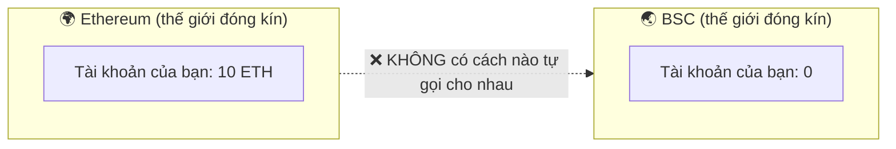
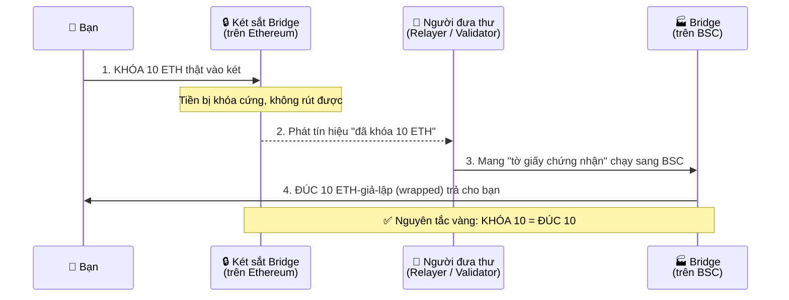
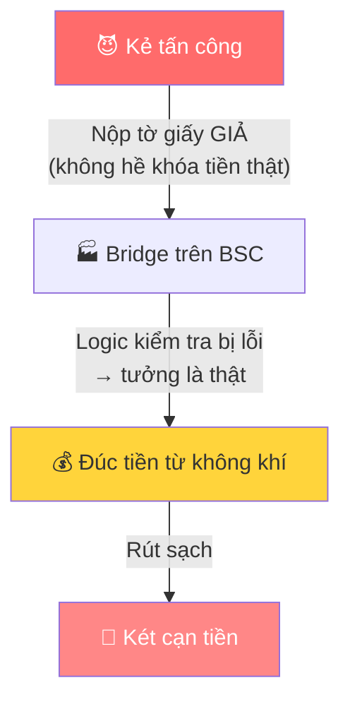
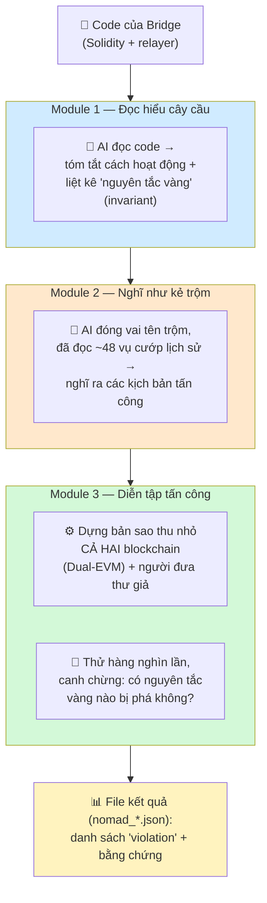
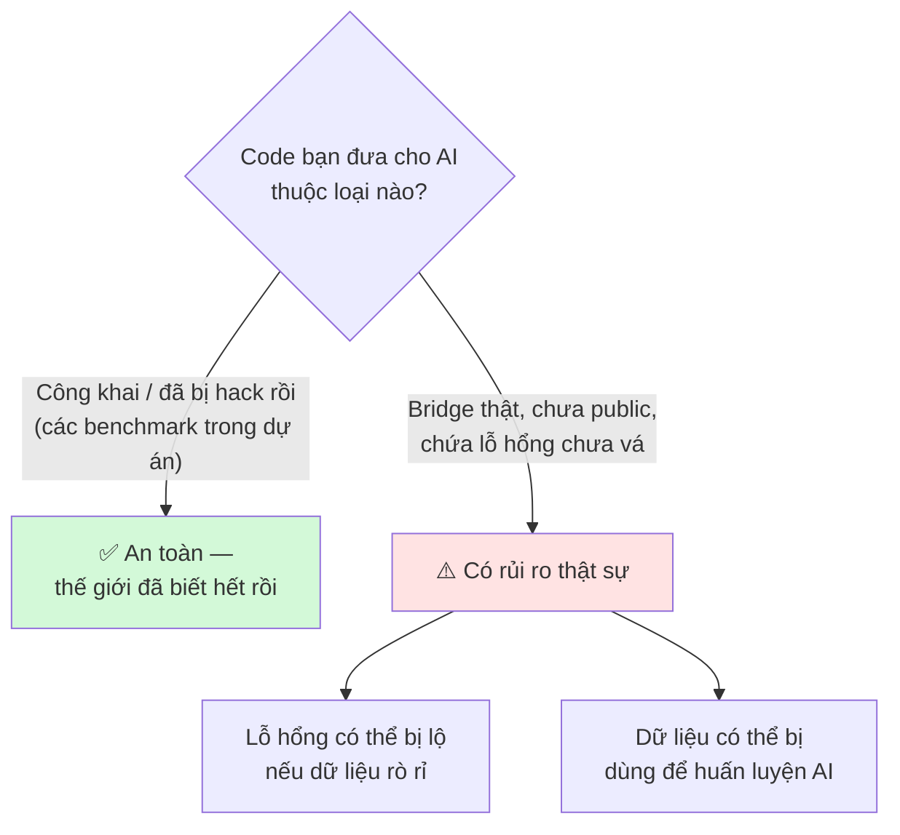

# Cross-Chain Bridge & Dự án BridgeSentry — Giải thích từ số 0

> Tài liệu này giải thích cho người **chưa biết gì về blockchain**. Đọc tuần tự từ trên xuống.
> Mục tiêu: hiểu được (1) blockchain là gì, (2) cầu nối chuỗi chéo là gì, (3) tại sao nó nguy hiểm,
> (4) dự án này làm gì, và (5) việc đưa code cho AI có an toàn không.

---

## Phần 1: Blockchain là gì?

Hãy tưởng tượng một **cuốn sổ cái ghi nợ** trong xóm.

- **Cách cũ:** một người giữ sổ (giống ngân hàng). Vấn đề: bạn phải **tin tưởng** họ — họ có thể sửa số, ghi gian, hoặc làm mất sổ.
- **Cách của blockchain:** thay vì 1 người giữ, **hàng nghìn máy tính khắp thế giới cùng giữ một bản sao y hệt**. Mỗi giao dịch mới (A chuyển 5 đồng cho B) phải được tất cả các máy đồng ý rồi mới ghi vào sổ. Đã ghi là **không sửa được** (muốn sửa phải hack đồng thời hàng nghìn máy).

**Ba điều cốt lõi cần nhớ:**

| Khái niệm | Giải thích đời thường |
|---|---|
| **Không cần tin ai** | Luật do *code* quy định, máy tự thực thi. |
| **Đồng tiền (ETH, BNB…)** | Chỉ là *con số trong cuốn sổ*. "Bạn có 10 ETH" = "sổ ghi địa chỉ của bạn có 10 ETH". |
| **Smart contract** | Một chương trình sống trên blockchain, tự động chạy theo luật đã lập trình. VD: "Ai gửi 1 ETH vào đây thì tự nhận 1 vé số" — không cần con người bấm nút. |

---

## Phần 2: Vấn đề — có RẤT NHIỀU blockchain, và chúng không nói chuyện được với nhau

Không chỉ có 1 blockchain. Có rất nhiều, mỗi cái là một "thế giới" đóng kín:
**Ethereum, BNB Chain (BSC), Solana, Avalanche, Polygon…**

> **Ẩn dụ then chốt:** Mỗi blockchain giống **một quốc gia dùng đồng tiền riêng, và KHÔNG có điện thoại / internet / đường biên giới nối với nước khác.**
> - Ethereum = "nước Mỹ" dùng USD.
> - BSC = "nước Nhật" dùng Yên.

Tiền của bạn ở Ethereum **không thể tự xuất hiện** ở BSC. Hai bên không thể "gọi điện" xác nhận cho nhau.
Nhưng người dùng lại **muốn** chuyển tài sản qua lại → cần một **cây cầu (cross-chain bridge)**.

---

## Phần 3: Cross-Chain Bridge hoạt động thế nào? (cơ chế "Khóa & Đúc")

Vì không thể "chuyển vật lý" đồng ETH sang chuỗi khác, bridge dùng mẹo **Lock-and-Mint (Khóa và Đúc)**.

Hình dung như **quầy đổi ngoại tệ ở sân bay**. Bạn có 10 ETH (Ethereum), muốn 10 "ETH" để dùng trên BSC:

**Diễn giải 3 bước:**

1. **KHÓA (Lock):** Bạn nộp 10 ETH thật vào *két sắt* (một smart contract) trên Ethereum. Tiền bị khóa cứng.
2. **ĐƯA TIN (Relay):** Vì hai chuỗi không nói chuyện được, cần **người đưa thư** (relayer / validator / guardian). Họ thấy "có người khóa 10 ETH" và mang *tờ giấy chứng nhận* sang BSC báo tin.
3. **ĐÚC (Mint):** Bridge bên BSC nhận tin, **đúc ra 10 ETH-giả-lập (wrapped-ETH)** đưa cho bạn — đại diện cho 10 ETH thật đang bị khóa bên kia.

Khi muốn quay về: **đốt** 10 đồng bên BSC → người đưa thư báo về → **mở khóa** 10 ETH thật bên Ethereum.

> ### ⭐ NGUYÊN TẮC VÀNG (invariant quan trọng nhất)
> **Số tiền KHÓA bên nguồn phải LUÔN bằng số tiền ĐÚC bên đích.**
> Khóa 10 → đúc đúng 10. Không bao giờ được khóa 10 mà đúc ra 30.
>
> Trong các file kết quả (`nomad_*.json`), nguyên tắc này có tên **`asset_conservation_total`** ("bảo toàn tài sản").

---

## Phần 4: Tại sao bridge lại NGUY HIỂM? (lý do dự án tồn tại)

Cây cầu là chỗ **yếu nhất và béo bở nhất** để hack:

1. **Két chứa cực nhiều tiền.** Mọi người gửi tiền vào khóa → két thường chứa hàng trăm triệu đến hàng tỷ USD. Hack được = trúng số độc đắc.
2. **Khâu "đúc tiền" là chí mạng.** Contract bên đích đúc tiền **chỉ dựa vào tờ giấy báo**. Nếu kẻ gian **làm giả tờ giấy** (hoặc lừa contract rằng "đã có người khóa tiền" trong khi thực ra chưa), nó **đúc tiền từ không khí** → rút sạch két.
3. **Hai thế giới không kiểm chứng được nhau.** Bên BSC **không thể tự kiểm tra** xem bên Ethereum có thật sự khóa tiền hay không — nó *buộc phải tin* tờ giấy. Nếu logic kiểm tra có lỗi → sập.

### Ví dụ thật: vụ Nomad — $190 triệu (2022)

- Sau một lần cập nhật cẩu thả, contract Nomad bên đích coi **MỌI tờ giấy báo đều hợp lệ** (kể cả tờ giấy trống/giả).
- Bất kỳ ai nộp tờ giấy giả "tôi đã khóa X tiền" → contract ngoan ngoãn đúc tiền đưa → rút két.
- Vì lỗi quá dễ, **hàng trăm người copy giao dịch của nhau** để cùng hôi của → vét sạch $190M trong vài giờ.

### Các thiệt hại lớn khác
| Bridge | Thiệt hại | Năm |
|---|---|---|
| Ronin | $624M | 2022 |
| PolyNetwork | $611M | 2021 |
| Wormhole | $326M | 2022 |
| Nomad | $190M | 2022 |

**Tổng các vụ hack bridge: hơn $4.3 tỷ USD.** → Đây là động lực của dự án.

---

## Phần 5: Dự án BridgeSentry (CrossLLM) làm gì?

Một **công cụ tự động tìm lỗ hổng TRƯỚC khi kẻ xấu tìm ra.** Gồm 3 module:

1. **Module 1 — Đọc hiểu:** Đưa code bridge cho **AI (LLM)** đọc. AI tóm tắt cách hoạt động và liệt kê các *nguyên tắc vàng* tuyệt đối không được vi phạm → đây là các **invariant**.
2. **Module 2 — Nghĩ như kẻ trộm:** AI đóng vai **tên trộm** đã đọc hồ sơ ~48 vụ cướp cầu trong lịch sử, rồi tự nghĩ "nếu là tôi, tôi sẽ phá cầu này bằng chiêu nào" → ra danh sách **kịch bản tấn công** (`trigger_scenario`).
3. **Module 3 — Diễn tập:** Dựng **bản sao thu nhỏ của CẢ HAI blockchain** (Dual-EVM = 2 máy ảo chạy song song) + "người đưa thư giả", rồi **thử đi thử lại hàng nghìn lần** các kịch bản, mỗi lần canh: *có nguyên tắc vàng nào bị phá không?*

### Đọc hiểu file kết quả (`nomad_*.json`)

Mỗi khi một cú tấn công **thành công phá vỡ nguyên tắc vàng**, công cụ ghi lại thành một **`violation`**:

| Trường | Ý nghĩa |
|---|---|
| `invariant_id` | Nguyên tắc vàng nào bị phá (vd `asset_conservation_total`) |
| `trigger_scenario` | Kịch bản tấn công gây ra (vd `nomad_duplicate_mint_2024_01`) |
| `trigger_trace` | Chuỗi giao dịch để tái hiện |
| `state_diff` | **Bằng chứng**: vd `source_total=1` (khóa) nhưng `dest_total=3` (đúc) → đúc nhiều hơn khóa = lỗi! |

**Điểm mới so với công cụ cũ:** các công cụ an ninh trước đây chỉ soi được **1 blockchain một lúc** → mù với chính khâu nguy hiểm nhất (sự ăn khớp giữa hai bên cầu). Dự án này mô phỏng **cả hai bên cùng lúc** + dùng **AI nghĩ ra đòn tấn công** → bắt được lỗi mà công cụ cũ bỏ sót.

---

## Phần 6: ⚠️ Đưa code bridge cho AI có an toàn không? Liệu AI có thu thập dữ liệu?

Đây là một câu hỏi **rất đúng và quan trọng**. Trả lời thẳng:

### Câu trả lời ngắn
Với **dự án nghiên cứu / luận văn này** thì **rủi ro rất thấp**, vì:

1. **Code bridge dùng trong dự án là code CÔNG KHAI.** Toàn bộ smart contract trên blockchain đều **public** — ai cũng xem được trên Etherscan/BscScan. Hơn nữa, các bridge dùng làm benchmark (Nomad, Ronin, Wormhole…) **đã bị hack từ lâu và đã công bố đầy đủ**. Đưa cho AI không lộ thêm bí mật gì cả.
2. **Đây là code mô phỏng/tái dựng, không phải hệ thống đang chạy thật chứa tiền.**

→ Nói cách khác: bạn đang đưa cho AI thứ mà **cả thế giới đã biết rồi**.

### Nhưng nếu là bridge THẬT, chưa public, chưa audit thì sao?

Lúc đó mối lo của bạn là **chính đáng**. Cần phân biệt rõ rủi ro:

### Hai mối lo cụ thể & cách xử lý

**Mối lo 1: "AI sẽ học/lưu lại code của tôi (training data)."**
- Các API trả phí cho doanh nghiệp (OpenAI API, Anthropic, Azure…) thường **cam kết KHÔNG dùng dữ liệu của bạn để huấn luyện** (khác với bản web miễn phí ChatGPT — bản miễn phí *có thể* dùng). Phải đọc kỹ điều khoản (Data Usage Policy) của nhà cung cấp.
- **NVIDIA NIM** mà dự án đang dùng (tier dev miễn phí): cần kiểm tra điều khoản — bản miễn phí thường có quyền dùng dữ liệu rộng hơn bản trả phí.

**Mối lo 2: "Dữ liệu nhạy cảm bị gửi ra server bên ngoài."**
- Mọi lời gọi API LLM = **gửi code ra máy chủ của nhà cung cấp** → về lý thuyết họ thấy được.

### Giải pháp an toàn (xếp theo mức độ)

| Mức | Cách làm | Khi nào dùng |
|---|---|---|
| 🟢 Đủ cho dự án này | Chỉ dùng **code công khai/đã bị hack** làm benchmark | Luận văn hiện tại — **đang làm đúng rồi** |
| 🟡 Tốt hơn | Dùng **API trả phí có cam kết không-train** (OpenAI API/Anthropic), bật "zero data retention" nếu có | Khi xử lý code chưa public |
| 🟠 An toàn cao | **Ẩn danh code** trước khi gửi: đổi tên biến/hàm, bỏ địa chỉ thật, chỉ gửi đoạn logic cần phân tích | Code nhạy cảm vừa phải |
| 🔴 An toàn tối đa | Chạy **LLM nội bộ (self-hosted/offline)** như Llama, gpt-oss trên máy riêng — dữ liệu **không bao giờ rời máy bạn** | Bridge thật chưa audit, bí mật thương mại |

> **Kết luận cho luận văn của bạn:** việc đưa code các bridge-đã-bị-hack cho AI là **hoàn toàn ổn về mặt bảo mật**, vì đó là dữ liệu công khai. Nhưng đây là một **điểm hạn chế (limitation) đáng ghi vào paper**: "Nếu áp dụng BridgeSentry cho bridge thật chưa công bố, nên dùng LLM self-hosted hoặc API có cam kết zero-retention để tránh rò rỉ lỗ hổng chưa vá." → Đây cũng là một câu trả lời rất ghi điểm nếu giám khảo/ thầy hỏi.

---

## Tóm tắt một câu (dùng để mở đầu thuyết trình)

> "Mỗi blockchain là một ốc đảo tài chính riêng biệt, không nói chuyện được với nhau. **Cross-chain bridge** là cây cầu chuyển tiền giữa các ốc đảo bằng cách *khóa tiền thật một bên và đúc tiền đại diện ở bên kia*. Nhưng vì hai bên không tự kiểm chứng được nhau, cây cầu là nơi dễ bị cướp nhất — đã mất hơn 4 tỷ USD. **Dự án của tôi dùng AI để tự động đóng vai kẻ trộm, diễn tập tấn công trên bản sao của cả hai chuỗi cùng lúc, nhằm tìm lỗ hổng trước khi tin tặc tìm ra.**"
